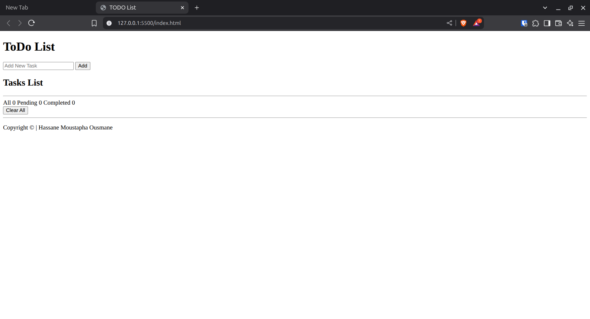
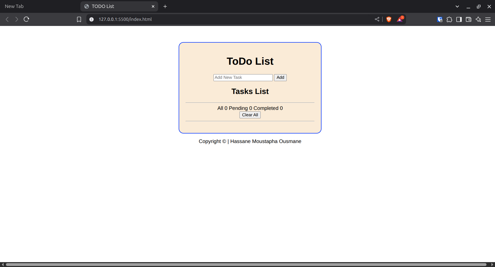

# Ma Première Application Web Todo List

## Contexte et Objectifs

Dans ce mini projet, vous allez créer votre première application web interactive ! Ce projet vous permettra de mettre en pratique ce que vous avez appris sur HTML, CSS et JavaScript en créant une application de gestion de tâches (Todo List) que vous pourrez utiliser au quotidien et montrer fièrement à vos amis et famille.

**Pourquoi ce projet ?**

- Il couvre tous les concepts essentiels du développement web qu'on a eu à aborder.
- Vous verrez immédiatement le résultat de votre travail.
- C'est un projet utile que vous pouvez vraiment utiliser.
- Il vous prépare à des projets plus complexes.

## Prérequis

À fin de pouvoir aborder ce projet avec aisance, vous devrez avoir au préable assimilé les notions (en JavaScript) suivantes:

- Les variables et types de données
- Les fonctions
- La structure conditionnelle if/else
- Le DOM
  - Selectionner un élément du DOM
  - Manipuler le contenu d'un élément
  - Créer et ajouter un nouveau élément au DOM
- Les événements
- Les calsses CSS avec JavaScript
- Les tableaux (particulièrement les méthodes des tableaux)
- Les objets (et propriétés)
- Le concept de template literals
- Optionnellement
  - Les callbacks (fonctions de rappel)
  - La destrcuturation

Pour tester votre connaissance sur ces notions, vous pouvez resoudre l'exercice qui se trouve [ici](./test.md).

## Ce que votre application doit faire

Votre application doit avoir les fonctionnalités suivantes.

### Fonctionnalités de Base

Pour un début, vous devrez impérativement implémenter les fonctionnalités de base ci-dessous.
***NOTE:*** *Il est conseillé de d'abord bien maîtriser ces fonctionnalités de base avant de passer à l'étape suivante.*

1. **Ajouter une tâche** :
   - Un champ de texte où taper une nouvelle tâche
   - Un bouton "Add" pour l'ajouter à la liste
   - Exemple de tâches: "Faire les courses", "Appeler maman"

2. **Voir mes tâches** :
   - Toutes mes tâches s'affichent dans une belle liste
   - Chaque tâche a une case à cocher à gauche

3. **Modifier une tâche** :
   - Si je me trompe, je peux cliquer sur "Editer" pour corriger
   - Exemple : changer "Faire les course" en "Faire les courses"

4. **Supprimer une tâche** :
   - Cliquer sur "Delete" pour enlever une tâche
   - L'application demande "Êtes-vous sûr ?" pour éviter les erreurs

### Fonctionnalités Avancées (Une fois que vous maîtrisez les bases)

5. **Marquer comme terminée** :
   - Cocher la case quand j'ai fini la tâche
   - La tâche devient barrée et grise

6. **Filtrer mes tâches** :
   - Voir "Toutes" mes tâches
   - Voir seulement celles "En attente"
   - Voir seulement celles "Terminées"

7. **Compteurs automatiques** :
   - Affiche combien j'ai de tâches au total
   - Combien sont terminées, combien restent à faire

8. **Tout effacer** :
   - Un bouton pour supprimer toutes les tâches d'un coup

## Outils et Technologies

### Ce que vous allez utiliser

- **HTML** : Pour définir la structure de votre page
- **CSS** : Pour la mise en forme (styliser et rendre votre application belle)
- **JavaScript** : Pour rendre votre application interactive

### Pas besoin d'installer quoi que ce soit

Vous avez déjà tout ce qu'il faut :

- Un navigateur web (Chrome, Firefox, ...)
- Un éditeur de texte (VS Code de preférence)

### Structure de votre projet

```bash
mon-todo-list/
├── index.html          # La page principale (ce que vous voyez)
├── style.css           # Les couleurs et la mise en forme
├── script.js           # La logique (ce qui fait fonctionner l'application)
└── README.md           # Vos notes et explications
```

## À quoi doit ressembler votre application

### L'apparence générale

Imaginez une application simple et claire avec :

- **Un titre** : "ToDo List" en haut de la page
- **Une zone de saisie** :
  - Une boîte de texte avec écrit "Ajouter une Nouvelle Tâche"
  - Un bouton "Ajouter" à côté
- **Des onglets de filtre** :
  - "Toutes (0)" pour voir toutes les tâches
  - "En attentes (0)" pour les tâches à faire
  - "Terminées (0)" pour les tâches terminées
- **La liste des tâches** :
  - Chaque tâche a une case à cocher
  - Le texte de la tâche
  - Un bouton "Éditer" et un bouton "Supprimer"

### Les couleurs et le style

- Fond blanc ou couleur claire
- Bordure bleue (mais pas forcement) autour de l'application
- Les tâches terminées sont barrées et grises
- Tout est centré et bien aligné

## Comment procéder

Pour réaliser ce travail, vous pouvez suivre les étapes suivantes.

### Étape 0: Créer un dossier pour le projet

- Créer un dossire avec un nom parlant pour le projet (todo-list ou ma-todo-list par exemple).
- Ouvrir le dossier dans votre éditeur de text preféré (VS Code ou autre).

### Étape 1 : La Structure HTML

Pour créer le "squelette" de la page:

- Créez le fichier `index.html`
- Ajoutez le titre, le champ de texte, le bouton
- Créez la zone où vos tâches vont apparaître
- **Test :** Votre page s'affiche dans le navigateur (même si ce n'est pas encore)

<!-- [Screen shot 1](./screen-shots/screen-shot1.png) -->
<center>
    
</center>

### Étape 2 : Le Style CSS

Cette étape s'interesse à la mise en form de votre application. Pour ce faire:

- Créez le fichier `style.css`
- Centrez tout sur la page
- Ajoutez des couleurs, des bordures
- Rendez les boutons jolis
- **Test :** Votre page est un peu plus belle même si elle ne fonctionne pas encore

<center>
    
</center>

### Étape 3 : JavaScript de base

Maintenant que votre page est bien définie et stylisé, on s'interesse à l'ajout des tâches.

- Créez le fichier `script.js`
- Programmez l'ajout d'une nouvelle tâche
- Affichez les tâches dans la liste
- **Test :** Vous pouvez ajouter des tâches !

### Étape 4 : Fonctionnalités avancées

Ici, vous allez mettre en place suivantes: cocher (i.e. marquer une tâche comme terminée), modifier, supprimer une tâche.

- Ajoutez la possibilité de cocher les tâches
- Implémenter les boutons "Éditer" et "Supprimer"
- **Test :** Votre application est complètement fonctionnelle !

### Étape 5 : Les finitions

Pour terminer, mettre en place les filtres et compteurs.

- Ajoutez les filtres (Toutes, En attentes, Terminées)
- S'assurer que le compteur se met à jour automatiquement
- **Test :** Votre application est parfaite !

## Livrables

1. **Vos 4 fichiers** :
   - `index.html` (votre page web)
   - `style.css` (vos styles)
   - `script.js` (votre code JavaScript)
   - `README.md` (vos explications)

2. **Dans le README.md, écrivez** :
   - Une brève description de l'application
   - Comment ouvrir votre application
   - Les difficultés que vous avez rencontrées
   - Ce dont vous êtes le plus fier
   - Les améliorations que vous aimeriez ajouter

3. **Une application qui fonctionne** :
   - On doit pouvoir ouvrir `index.html` dans un navigateur
   - Toutes les fonctionnalités marchent
   - C'est joli et agréable à utiliser

## Planning Suggéré (Allez à votre rythme !)

**Total : 2-3 jours** (mais prenez le temps qu'il vous faut)

- **Jour 1** : HTML + CSS (la base)
- **Jour 2** : JavaScript (ajouter, afficher, supprimer)
- **Jour 3** : Finitions (filtres, compteurs, tests)

**Conseil :** Commencez petit ! Une application simple qui marche vaut mieux qu'une application compliquée qui ne marche pas.

## Ressources

### Si vous êtes bloqué

- **MDN Web Docs** : Documentation officielle (en français)
- **W3Schools** : Tutoriels simples avec exemples
- **Stack Overflow** : Posez vos questions
- **YouTube** : Recherchez "todo list javascript débutant"

### Concepts importants à réviser

- **HTML** : `div`, `input`, `button`, `ul`, `li`
- **CSS** : `class`, `id`, sélecteurs, `display`, `color`
- **JavaScript** : variables, fonctions, DOM, événements

## Message de Motivation

**Félicitations pour vous lancer dans ce projet !**

Rappelons-nous que tous les développeurs ont commencé par un petit projet comme celui-ci. Même les plus grands ont eu des difficultés avec leur première Todo List. Alors, l'important c'est de :

- **Prendre son temps** : Il vaut mieux comprendre que d'aller vite
- **Tester souvent** : Après chaque petite modification, vérifiez que ça marche
- **Ne pas avoir peur des erreurs** : Les bugs font partie de l'apprentissage, faites des erreurs, surmonter les
- **Être fier de son travail** : Chaque ligne de code est une victoire !

*Bon travail!*
